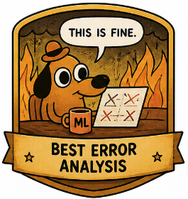
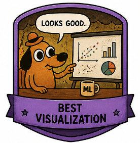
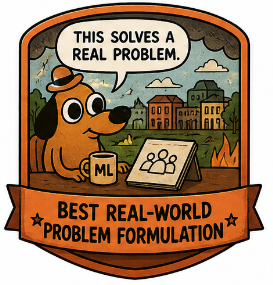

  

# Group Project: _Can AI Help You Build a Better Machine Learning Model?_

**Course:** ICT 3.3 Machine Learning and Data Mining  
**Date:** May 2026  

In this group project, you will build a small machine learning pipeline and critically test whether an AI assistant can improve one part of your work.

The AI assistant may help you think, compare, or debug, but it must **not replace your own modelling decisions**.

| Item | Requirement |
|---|---|
| Group size | 2–4 students |
| Output | 5-minute presentation |
| Main deliverable | Small ML pipeline + critical AI assistant use |
| Required model | At least one baseline ML model |
| Required analysis | Evaluation + 3 model mistakes |

---

## Main Requirements

Your project must include:

1. Choose one dataset and understand its variables.
2. Define one clear machine learning problem.
3. Build at least one baseline ML model.
4. Evaluate the model using appropriate metrics.
5. Perform error analysis: what does the model get wrong and why?
6. Add one light, controlled LLM component and critically evaluate whether it helped.

---

## Project Tracks

| Track | Type | Goal | Examples |
|---|---|---|---|
| **📈 Track A — Predict Something Useful** | Regression / Classification | Predict outcomes | exam scores, house prices, bike rentals, churn, health risk |
| **💬 Track B — Classify Text or Behaviour** | Classification | Label text or behaviour | reviews, spam, news headlines, user actions |
| **🧩 Track C — Discover Hidden Groups** | Clustering | Find hidden structure | songs, customers, countries, penguins, documents |
| **🤖 Track D — AI vs Classical ML** | Comparison | Compare ML model vs LLM | accuracy, behaviour, strengths, weaknesses |

---

## Dataset Menu

You may choose your own dataset, but the following options are beginner-friendly and suitable for bachelor-level ML projects.

Some Kaggle datasets may require a free [Kaggle](https://www.kaggle.com/) account.

| Theme | Dataset | Link | Possible task | Good for |
|---|---|---|---|---|
| Education | UCI Student Performance | [Open dataset](https://archive.ics.uci.edu/dataset/320/student%2Bperformance) | Predict final grade; classify pass/fail; analyze important factors | Regression, classification, feature engineering |
| Urban mobility | UCI Bike Sharing | [Open dataset](https://archive.ics.uci.edu/ml/datasets/bike%2Bsharing%2Bdataset) | Predict number of bike rentals from weather, season, and time | Regression, error analysis, time features |
| Music | Spotify Tracks Attributes and Popularity | [Open dataset](https://www.kaggle.com/datasets/melissamonfared/spotify-tracks-attributes-and-popularity) | Predict popularity; cluster songs by audio features | Regression, classification, clustering |
| Health | UCI Heart Disease | [Open dataset](https://archive.ics.uci.edu/dataset/45/heart%2Bdisease) | Predict heart disease presence from clinical features | Binary classification, interpretability |
| Text / NLP | UCI SMS Spam Collection | [Open dataset](https://archive.ics.uci.edu/dataset/228/sms%2Bspam%2Bcollection) | Classify SMS messages as spam or ham | Text classification, prompt vs ML comparison |
| Movies | IMDb 50K Movie Reviews | [Open dataset](https://www.kaggle.com/datasets/lakshmi25npathi/imdb-dataset-of-50k-movie-reviews) | Classify reviews as positive or negative | NLP, sentiment analysis, LLM comparison |
| Biology / animals | Palmer Penguins | [Open dataset](https://github.com/allisonhorst/palmerpenguins) | Predict penguin species; cluster penguins by measurements | Classification, visualization, clustering |
| Food / chemistry | UCI Wine Quality | [Open dataset](https://archive.ics.uci.edu/ml/datasets/wine%2Bquality) | Predict wine quality from chemical properties | Regression, classification, feature scaling |

---

## Controlled LLM Component

Choose **one** of the following options.

### Option 1 — Problem Formulation Assistant

Ask an LLM what ML problems could be solved with your dataset.

Then:

- compare the LLM suggestion with your own idea
- justify your final task
- identify whether it is classification, regression, clustering, or another method

### Option 2 — Feature Engineering Helper

Ask an LLM to suggest useful features.

Then:

- implement exactly one suggestion
- test whether the model improves compared with the baseline
- explain why the suggestion helped or did not help

### Option 3 — Error Analysis Assistant

Show the LLM a few model mistakes.

Ask why the mistakes might happen.

Then relate the explanation to ML concepts such as:

- overfitting
- underfitting
- data quality
- class imbalance
- missing features

### Option 4 — Prompt vs Model Comparison

Compare a classical ML model with an LLM prompt on the same examples.

Report:

- accuracy
- qualitative behaviour
- whether the LLM is sensitive to prompt wording

---

## Minimum Experiment & Error Analysis

Your project must include:

1. **Baseline model**  
   Train a simple model using the original features.

2. **Improved version**  
   Change one thing: a feature, model, preprocessing step, or LLM-assisted idea.

3. **Evaluation**  
   Compare baseline vs improved version using the same train/test split and appropriate metrics.

4. **Error analysis**  
   Choose **three interesting mistakes** and explain:
   - input example
   - true label/value
   - model prediction
   - why it may have failed
   - what you would try next

5. **Interpretation**  
   Explain what changed, whether performance improved, and why.

## What to Submit

Each group should submit:

- Presentation slides
- Code notebook or script
- Short README explaining how to run the project
- Dataset link or data source
- Short note describing how the AI assistant was used

## Do / Don’t

| Do | Don’t |
|---|---|
| Use a simple baseline first | Start with a complex model immediately |
| Keep the same train/test split for comparisons | Compare models unfairly |
| Explain errors with concrete examples | Only report accuracy |
| Use the LLM in a controlled way | Let the LLM decide everything |
| Be honest if the LLM did not help | Pretend every AI suggestion improved results |

---

## Final Presentation Format

Each group gives a **5-minute presentation**.

| Slide | Content |
|---|---|
| 1 | Problem and dataset |
| 2 | ML approach and baseline |
| 3 | Best result and metric |
| 4 | Most interesting error |
| 5 | Did the AI assistant help or mislead you? |

---

## Assessment Suggestion

| Criterion | Weight | What matters |
|---|---:|---|
| Problem formulation | 15% | Clear task, dataset understanding, appropriate ML framing |
| ML implementation | 25% | Correct preprocessing, baseline, modelling, and reproducibility |
| Evaluation | 20% | Appropriate metrics, fair comparison, clear interpretation |
| Error analysis | 20% | Concrete mistakes, thoughtful explanations, links to ML concepts |
| Critical LLM use | 15% | Controlled use, comparison with own reasoning, honest limits |
| Presentation clarity | 5% | Clear story, readable visuals, concise delivery |

---

## Bonus Badges

Groups may receive bonus recognition for:

## 🏆 Bonus Badges

<table>
<tr>
<td align="center">
 
Best error analysis
</td>
<td align="center">
 
Best feature engineering idea
</td>
<td align="center">
 
Best critical use of an LLM
</td>
</tr>
<tr>
<td align="center">
 
Best visualization
</td>
<td align="center">
 
Best real-world problem formulation
</td>
<td align="center">
 
Best tech smart
</td>
</tr>
</table>

---

## Reminders

1. A strong project is **not** the one with the highest accuracy. A strong project is one where you:
- understand the data
- make reasonable choices
- test them fairly
- explain what the model still does not understand

2. Start simple. A clear baseline, fair comparison, and thoughtful error analysis are more important than using the most advanced model.

> Good ML is not only about improving scores. It is about understanding what the model learns, what it misses, and why.
